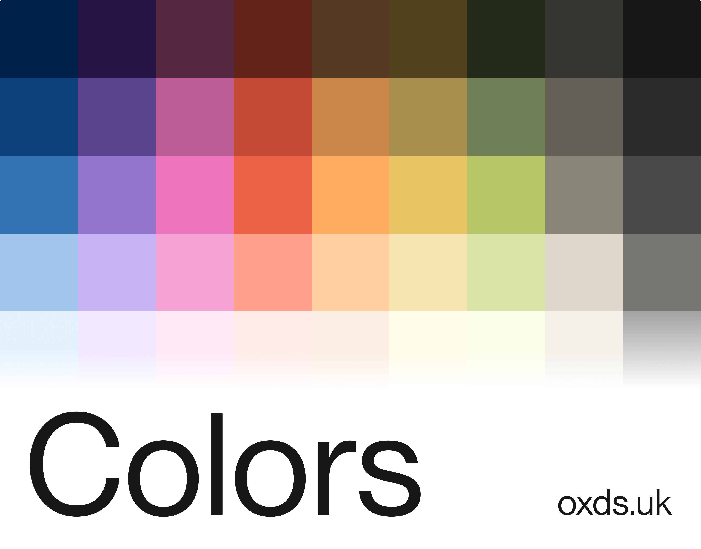

# OxDS Colors

**A uniquely simple color system.**

OxDS colors can be accessed programmatically or through CSS. Developers can dynamically set styles, generate CSS variables, or integrate with CSS-in-JS libraries. 

Currently in beta and changes are being made regularly. Theming will be present in our future versions. You can find more information on [oxds.uk/foundations/colors](https://oxds.uk/foundations/colors). 

## Installation

View the colors and how to install, import, and use at [oxds.uk/foundations/colors](https://oxds.uk/foundations/colors).

## Author

- Josh H ([j-o.sh](https://j-o.sh))

### License

Licensed under the MIT License, Copyright (c) 2025 Josh H, OxDS

See [LICENSE](./LICENSE) for more information.
